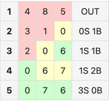

## **숫자 야구 게임이란?**

숫자 자리수를 임의로 정한 뒤, 서로에게 숫자를 불러서 결과를 확인한다. 그리고 그 결과를 토대로 상대가 적은 숫자를 예상한 뒤 맞힌다.
사용되는 숫자는 0에서 9까지 서로 다른 숫자이다. 경우에 따라 0은 사용하지 않기도 하며 0이 첫번째 숫자로 올 수 없게하는 룰도 있다.

숫자는 맞지만 위치가 틀렸을 때는 볼.
숫자와 위치가 전부 맞으면 스트라이크.
숫자와 위치가 전부 틀리면 아웃. 
물론 무엇이 볼이고 스트라이크인지는 알려주지 않는다.
두 숫자가 중복되면 경우의 수가 많아져서 그런지 중복 숫자는 잘 사용하지 않는다.



예시
각 회차별로 설명하자면,
1. 485 - 들어맞는 숫자가 아예 없으므로 아웃. 이때부터 4, 5, 8이 후보에서 빠지므로 남는 숫자는 0, 1, 2, 3, 6, 7, 9다.
2. 310 - 0이 있지만 위치가 다르므로 1볼. 게임 상으로는 어떤 숫자가 맞는지 모르기 때문에 가장 난감하다.
3. 206 - 6이 있고 위치가 맞으며, 0이 있지만 위치가 다르므로 1스트라이크 1볼.
4. 067 - 숫자는 전부 맞지만 위치는 0만 맞고 나머지 둘은 다르므로 1스트라이크 2볼.
5. 076 - 전부 맞으므로 승리.

출처 : https://namu.wiki/w/%EC%88%AB%EC%9E%90%EC%95%BC%EA%B5%AC

**구현 기능**
1. 숫자 야구게임 난이도를 3~9자리 까지 설정 가능하도록 구현(Lv4)

**예외처리**(Lv2)
1. 설정된 난이도 자리수가 아닌 경우 다시 입력
2. 숫자가 중복 시 다시 입력
3. 숫자가 아닌 값 입력 시 다시 입력


## 4️⃣ **필수 기능 가이드**

### Lv 1. 기본 게임 구현 (숫자 야구 게임)  `필수`

- [ ]  **정답 숫자 생성하기**
    - [ ]  정답은 서로 다른 3자리 수이다.
    - [ ]  각 자리는 1~9 사이의 숫자이다.
    - [ ]  동일한 숫자는 사용될 수 없다. 즉, 숫자는 중복되지 않아야 한다.
    - [ ]  ex) 333, 112, 119 `불가능`
    - [ ]  `Hint!`
        - [ ]  `Random 클래스`, `HashSet 클래스`
        - [ ]  +) 리스트의 요소를 랜덤하게 섞는다면? `Collection.shuffle`
- [ ]  **정답을 맞추기 위해 숫자를 입력하기**
    - [ ]  서로 다른 3자리 수를 입력할 수 있다.
    - [ ]  동일한 숫자는 사용될 수 없다. 즉, 숫자는 중복되지 않아야 한다.
    - [ ]  숫자만 입력 가능하며, 문자는 작성할 수 없다.
- [ ]  **결과값 출력 및 게임 로직 적용하기**
    - [ ]  정답과 입력값을 비교해 힌트를 “볼, 스트라이크, 아웃”으로 표시합니다.
        - [ ]  스트라이크 : 입력값과 정답을 비교해 같은 자리에 같은 숫자가 있는 경우
        - [ ]  볼 : 숫자는 같지만, 자리는 다른 경우
        - [ ]  아웃 : 숫자도, 자리도 다른 경우
    - [ ]  입력한 3자리 숫자가 정답과 같은 경우, 게임이 종료됩니다.
        - [ ]  ‘3 스트라이크’라면, 정답에 해당합니다.
        - [ ]  정답일 때, 표시하고 싶은 메세지는 여러분이 지정해주세요.
    - [ ]  올바르지 않은 입력값에 대해서는 오류 문구를 보여주세요.
        - [ ]  입력값이 문자, 중복되는 값처럼 요구사항과 맞지 않을 경우
    - 실행 예시(정답 : 456인 경우) - Lv2 내용 포함된 최종 실행 예시

        ```kotlin
        < 게임을 시작합니다 >
        숫자를 입력하세요
        435
        1스트라이크 1볼
        
        숫자를 입력하세요
        357
        1스트라이크
        
        숫자를 입력하세요
        123
        아웃
        
        숫자를 입력하세요
        dfg // 세 자리 숫자가 아니어서 올바르지 않은 입력값
        올바르지 않은 입력값입니다
        
        숫자를 입력하세요
        199 // 9가 두번 사용되어 올바르지 않은 입력값
        올바르지 않은 입력값입니다
        
        숫자를 입력하세요
        103 // 0이 사용되어 올바르지 않은 입력값
        올바르지 않은 입력값입니다
        
        숫자를 입력하세요
        456
        정답입니다!
        ```

    - 코드 뼈대로 보기

        ```java
        public class Main {
            public static void main(String[] args) {
                // BaseballGame 객체 생성 & 게임 시작
            }
        }
        ```

        ```java
        public class BaseballGame {
        
            // 객체 생성시 정답을 만들도록 함
            public BaseballGame() {
        
            }
        
            public int play() {
                while (true) {
                    // 1. 유저에게 입력값을 받음
                    // 2. 올바른 입력값을 받았는지 검증
                    // 3. 게임 진행횟수 증가
                    // 4. 스트라이크 개수 계산
                    // 5. 정답여부 확인, 만약 정답이면 break 를 이용해 반복문 탈출
                    // 6. 볼 개수 계산
                    // 7. 힌트 출력
                }
                // 게임 진행횟수 반환
            }
        
            protected boolean validateInput(String input) {
        
            }
        
            private int countStrike(String input) {
        
            }
        
            private int countBall(String input) {
        
            }
        }
        
        ```

        ```java
        public class BaseballGameDisplay {
            public void displayHint(int strike, int ball) {
        
            }
        }
        
        ```

- [ ]  **게임 이어서하기**
    - [ ]  정답을 맞출 때까지 계속해서 시도할 수 있어야 하며, 정답을 맞추면 축하 메시지를 출력한다.

### Lv 2. 입력 및 출력 개선 (숫자 야구 게임)  `필수`

- [ ]  **입력값이 유효한지 검사하기**
    - [ ]  3자리 수인지 자릿수를 검사합니다.
    - [ ]  중복된 숫자가 없는지 중복 숫자를 검사합니다.
    - [ ]  입력값에 숫자만 포함되어 있는지 검사합니다.
    - [ ]  유효하지 않은 값인 경우 “올바르지 않은 입력값입니다.”를 출력합니다.
- [ ]  **출력 개선**
    - [ ]  프로그램을 시작할 때 안내문구를 보여주세요.
        - [ ]  1을 입력하면 **“필수 구현 기능”** 의 예시처럼 게임이 진행됩니다.([**클릭**](https://www.notion.so/Spring-3-CH-2-05652d2c81b343f7a4f7a4f67f5b79a0?pvs=21))
        - [ ]  “2. 게임 기록 보기”는 Lv3에서 제시됩니다. (2는 입력할 수 없습니다.)
        - [ ]  3을 입력하면 게임이 종료됩니다.
    - [ ]  정답을 맞히는 경우, 아래 안내문구를 다시 보여주세요.

       ```kotlin
       // 예시
       환영합니다! 원하시는 번호를 입력해주세요
       1. 게임 시작하기 2. 게임 기록 보기 3. 종료하기
       1 // 1번 게임 시작하기 입력
       
       < 게임을 시작합니다 >
       숫자를 입력하세요
       .
       .
       .
       ```


---

## 5️⃣ 도전 기능 가이드

### Lv 3. 추가 기능 및 개선 (숫자 야구 게임)  `도전`

- [ ]  **게임 기록 통계**
    - [ ]  지금 시도하는 게임이 몇 번째 게임인지 기록합니다.
    - [ ]  사용자가 정답을 맞힐 때까지의 “시도 횟수”를 기록하고 게임이 끝났을 때, 총 시도 횟수를 출력합니다.
    - [ ]  프로그램 시작 및 정답을 맞히는 경우, 출력 개선([**클릭**](https://www.notion.so/Spring-3-CH-2-05652d2c81b343f7a4f7a4f67f5b79a0?pvs=21))에서와 같은 안내 문구를 출력하고, 2를 입력하면 게임의 시도 횟수를 출력합니다.

       ```kotlin
       // 예시
       환영합니다! 원하시는 번호를 입력해주세요
       1. 게임 시작하기  2. 게임 기록 보기  3. 종료하기
       2 // 2번 게임 기록 보기 입력
       
       < 게임 기록 보기 >
       1번째 게임 : 시도 횟수 - 14
       2번째 게임 : 시도 횟수 - 9
       3번째 게임 : 시도 횟수 - 12
       .
       .
       .
       ```

- [ ]  **출력 개선**
    - [ ]  실행 및 정답을 맞힌 경우, 표시되는 안내문구 선택지 개선
        - [ ]  3을 입력하면 게임이 종료됩니다.
        - [ ]  이전의 게임 기록들도 초기화됩니다.

       ```kotlin
       // 예시
       환영합니다! 원하시는 번호를 입력해주세요
       1. 게임 시작하기  2. 게임 기록 보기  3. 종료하기
       3 // 3번 종료하기 입력
       
       < 숫자 야구 게임을 종료합니다 >
       ```

    - [ ]  1, 2, 3 이외의 입력값에 대해서는 오류 메시지 노출

       ```kotlin
       // 예시
       환영합니다! 원하시는 번호를 입력해주세요
       1. 게임 시작하기  2. 게임 기록 보기  3. 종료하기
       4
       
       올바른 숫자를 입력해주세요!
       ```


### Lv 4. 추가 기능 및 개선 (숫자 야구 게임)  `도전`

- [ ]  **게임 난이도 조절**
    - [ ]  사용자로부터 난이도를 입력받고, 그에 따라 숫자의 자릿수를 조정할 수 있습니다.
    - [ ]  자리수는 3, 4, 5자리 숫자 중에서 선택할 수 있습니다.
        - [ ]  3, 4, 5 이외의 값에 대해서는 예외처리
    - [ ]  자리수를 입력하면 자동으로 게임이 실행됩니다.

   ```kotlin
   // 예시
   환영합니다! 원하시는 번호를 입력해주세요
   0. 자리수 설정 1. 게임 시작하기  2. 게임 기록 보기  3. 종료하기
   0 // 0번 자리수 설정 입력
   
   설정하고자 하는 자리수를 입력하세요.
   3
   3자리수 난이도로 설정되었습니다.
   
   < 게임을 시작합니다 >
   숫자를 입력하세요
   .
   .
   .
   ```